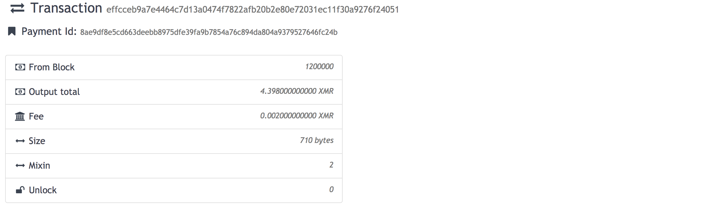
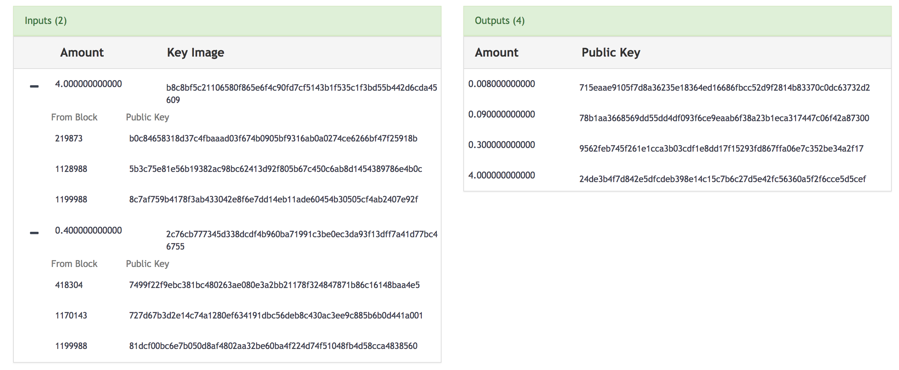

### 区块链隐私保护之门罗币

门罗币使用三项关键技术实现了区块链的交易隐私保护，这三项技术分别为 **隐秘地址 (stealth address)**、**环签名 (ring signature)**、**环签名机密交易 (Ring CT)**。

#### 隐秘地址

隐秘地址实现了**不可链接性 (unlinkability)**，即区块链系统中无关节点无法证明两个交易是发送给同一个人的。在一个区块链系统中，要想实现不可链接性，解决办法简单粗暴："一次一址"，即每一次收钱都使用不同的地址，隐秘地址的原理也在于此。具体细节详看 http://mjqin.github.io/Monero-Techs

#### 环签名

环签名实现了**不可追踪性 (untraceability)**，即区块链系统中无关节点无法知晓交易的发送方是哪一个。环签名思想是，使用私钥以及其它人的公钥生成一个签名，当其它节点验证时，只知道该签名是所引用的众多公钥中的一个，却无法定位具体的公钥。

当门罗币系统中的发起者构造一笔交易时，首先从区块链系统所记录的历史交易中，找寻到与自己想要使用的 output **同等面值**的其它 output (属于其它公钥)，注意是同等面值，各位可以思考一下，如果不是同等面值会发生什么？如若不是同等面值，门罗币系统中的其它节点怎么判断输入的金额是多少呢？如果是同等面值，那么其它节点因为知道花费的是其中的某一个，那么输入金额就可以确定了呢，所以这也给门罗币钱包构造交易时带来了扩展性上的不足。

来看一笔真实的门罗币交易：https://moneroblocks.info/tx/effcceb9a7e4464c7d13a0474f7822afb20b2e80e72031ec11f30a9276f24051

其中 Mixin 为 2 代表该交易的每一个 input 中引用了 2 个冗余输出，我们可以看到 input 中引用的上一笔交易输出金额都是 4。

那么上面的签名只是证明了发起者有权利花输入中引用的输出中的一个，但是怎么证明发起者不会双花呢？在以前的比特币系统中，节点会将输入引用的输出从 UTXO 集合中移走，从而保证 output 只被花费一次，但是在门罗币系统中，节点是不知道发起者消费的是哪一笔 output，那它是怎么做到防止双花的呢？答案就是 **Key Image** 。Key Image := x * Hp\(P\) ，其中 x 是私钥，P 是公钥，即 P = x * G。即相同的 P 导致会产生相同的 Key Image。所以门罗币系统中的节点会维护一个已见到过的所有 Key Image 集合，如果一笔交易的 Key Image 出现在该集合中，则被认为是无效的。其实在节点验证时，会首先验证 Key Image 是真实的，即 Key Image 的确是由众多输出中的一个输出公钥生成（这一部分的验证应该和环签名的技术有关，详见 https://monero.stackexchange.com/questions/4576/how-do-key-images-really-work ），然后才会再次验证 Key Image 是否已经在维护的集合中出现过。

#### Ring CT

参考文献：https://monero.stackexchange.com/questions/7716/how-does-ring-confidential-transactions-work

Ring CT 实现了交易金额的隐藏，具体步骤如下：

- 首先需要证明交易的所有输出金额是大于 0 的，防止下面的情况发生：发送者使用 1 XMR，生成两个输出，一个输出为 100 XMR，另外一个位 -99 XMR。这是通过 "range proof" 来实现的。

- 证明 Pedersen commitments of the inputs - Pedersen commitment of the transaction fee - Pedersen commitments of the outputs = a zero Perdersen commitment。

    Pedersen commitments 具有同态 (homomorphic)属性

    在此猜测：发送者为了找到可以使用的冗余输出，即金额相等的输出，应该会去遍历历史交易的输出，使用 Pedersen commitments of 自己的输出金额 - Pedersen commitments of 其它的输出金额 = a zero Perdersen commitment。

----

门罗币缺点：匿名集合不大，如果在 input 中引用过多的冗余输出，会导致交易体积变大，使得交易手续费很高。这一点不如 zcash 来的优雅
