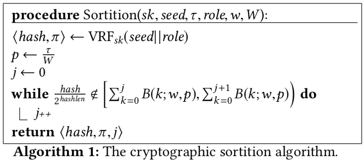

## 可验证随机数函数

可验证随机函数（verifiable random functions 简称 VRFs）概念由 Micali 等人[1]提出，它是一类伪随机函数，并且提供公共可验证的证据，来证明其输出的正确性。给定输入值 x，私钥 SK 的拥有者使用 y = F_SK(x) 生成随机数，并提供证据 P_SK(x)。验证者（任何人）使用 P_SK(x) 以及 SK 对应的公钥 PK 均可验证 y 是否由 F_SK(x) 计算得来，并且这些信息不能泄露私钥的信息。

### Algorand 共识算法

Algorand[2] 通过 VRFs 实现大规模用户的共识，VRFs 允许用户私下地检查他们是否被选中参与共识过程，选中的用户需要在其网络消息中包含被选中的证据，并且在发送完消息之后，这些用户将会轮换，以减轻攻击者对这些已知身份用户的定向攻击。

####密码学抽签

Algorand 提出了密码学抽签（cryptographic sortition）概念。密码学抽签是一类根据用户权重选择一组随机的用户集的算法。也就是说，给定用户权重 w_i 集合，总的权重为 W = ∑w_i，则用户 i 被选中的概率与 w_i/W 是成正比的。抽签算法中的随机性来源于公共可知的随机种子 seed；为了使得用户可以证明他们被选中，抽签算法要求每一个用户 i 拥有一个密钥对（pk_i, sk_i）。

抽签函数使用 VRFs 来实现，对于任何输入 x 来说，VRF_sk(x) 返回两个值：一个哈希值与一个证据。哈希值由 sk 与 x 唯一确定，但是对于不知道 sk 的人来说，无法区分该哈希值与随机数。知道 pk 的用户使用证据 π 可以检查哈希值是否由 VRF_sk(x) 得来。

##### 选举步骤

Algorand 实现的密码学抽签如下图所示：

抽签函数需要一个代表角色 role 的入参，用于区分被选中用户的角色。不同角色的用户承担的功能不同，例如，用户可能被选中用来提议某一轮的区块，或者用来参与 BA* 共识过程的不同阶段。Algorand 定义了阈值 τ 来表示期望选到相应角色的用户数量。

Reference
---------------
[1] Micali, Silvio; Rabin, Michael O.; Vadhan, Salil P. (1999). "Verifiable random functions". Proceedings of the 40th IEEE Symposium on Foundations of Computer Science. pp. 120–130

[2] Gilad Y, Hemo R, Micali S, et al. Algorand: Scaling Byzantine Agreements for Cryptocurrencies[C]// The, Symposium. 2017:51-68.
